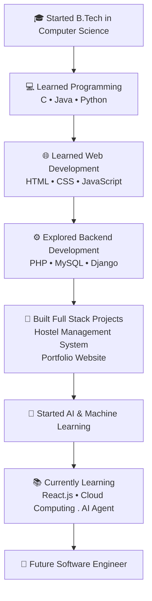

  

<h1 align="center" style="font-size:60px;">
  Hi 👋, I'm Sree Latha

### Computer Science Engineering Student | Full Stack Developer | AI/ML Enthusiast
</h1>

## 👩‍💻 Professional Summary

I am a Computer Science Engineering student passionate about Software Development, 
Web Technologies, Artificial Intelligence, and Machine Learning.

I enjoy building real-world applications using modern technologies and solving 
problems through clean and efficient code. Currently focusing on Full Stack 
Development, AI/ML projects, and improving my programming skills.

I am actively looking for internship opportunities where I can learn, contribute, 
and grow as a software developer.

## ℹ️ Quick Info

| Category | Information |
|----------|-------------|
| 🎓 Education | B.Tech Computer Science Engineering |
| 💻 Role | Full Stack Developer |
| 📍 Location | India |
| 🚀 Interests | Web Development, AI/ML, Software Engineering |
| 📚 Learning | React, JavaScript, Python, Machine Learning |
| 🤝 Open To | Internships, Hackathons, Open Source Projects |

# 🛠️ Tech Stack

# 🚀 Current Focus

| Currently Learning | Currently Building |
|--------------------|-------------------|
| Full stact development,react,js | Hostel Management System ,portfolio website|
| Machine Learning,AI Agent| AI/ML Projects |
| Cloud Technologies | Web Applications |

## 📂 Featured Projects

- **🏠 Hostel Management System:** Full-stack web application for hostel  management system .
- **🌐 Portfolio Website:** Professional portfolio showcasing my projects and technical skills.
- **🤖 AI/ML Projects:** Intelligent applications built using Python and Scikit-learn.
- **💻 Open Source Projects:** Personal and academic projects available on my GitHub.

## 📈 GitHub Analytics

  

  

  

## ⏳ Developer Journey

# 📫 Connect With Me

📧 Email: your-email@gmail.com

💼 LinkedIn: Add your LinkedIn profile link

🌐 Portfolio: Add your portfolio website link

---

### "The best way to predict the future is to create it."

⭐ Thanks for visiting my profile!  
Let's build something amazing together 🚀
